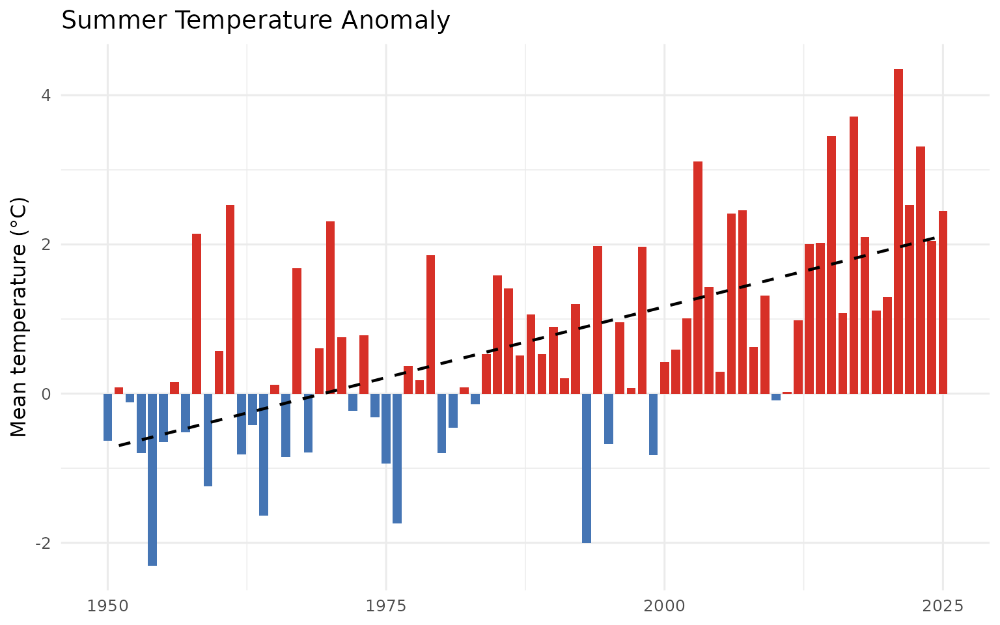
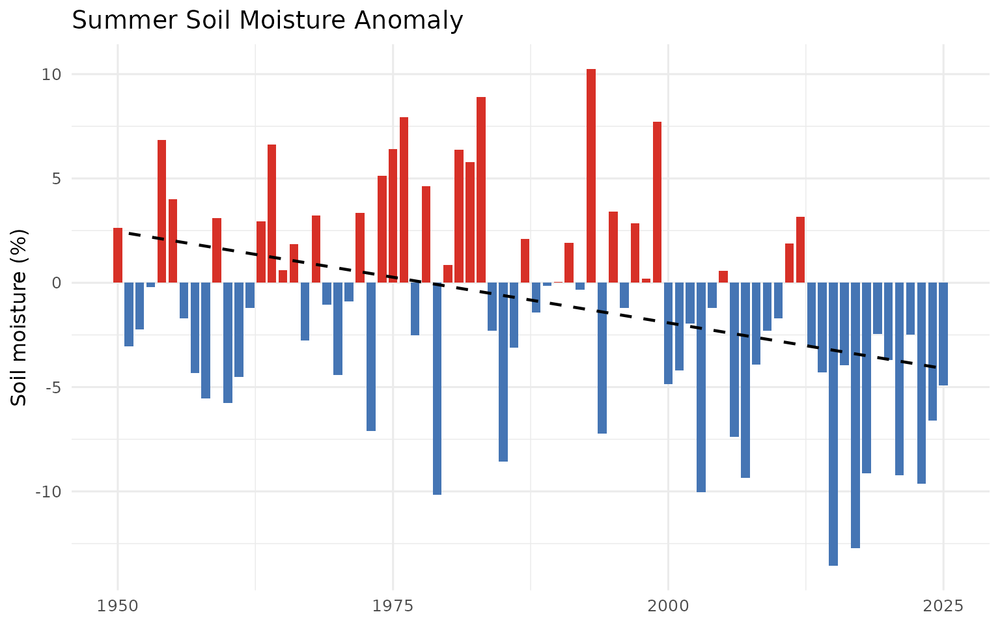

# Climate Departure Analysis for a Watershed

The cd package computes climate departure statistics from ERA5-Land
reanalysis data for any area of interest. This vignette demonstrates the
full analysis pipeline: connecting to the cloud-hosted data catalog,
extracting zonal means for a watershed, computing anomalies against a
pre-warming baseline, and running trend analysis.

## Area of Interest

We use the Kootenay Lake (KOTL) watershed group from the BC Freshwater
Atlas, shipped with the package. Any `sf` polygon works as an AOI.

``` r
library(cd)
library(sf)

aoi <- st_read(
  system.file("extdata", "example_aoi_kotl.gpkg", package = "cd"),
  quiet = TRUE
)
```

``` r
aoi_bb <- sf::st_bbox(aoi)

ggplot() +
  geom_sf(data = aoi, fill = "#f0f0f0", color = "#2166ac", linewidth = 0.8) +
  geom_sf(data = lakes, fill = "#a6bddb", color = "#74a9cf", linewidth = 0.2) +
  geom_sf(data = rivers, fill = "#a6bddb", color = "#74a9cf", linewidth = 0.2) +
  geom_sf(data = streams, color = "#74a9cf", linewidth = 0.4, alpha = 0.6) +
  geom_sf(data = highways, color = "#333333", linewidth = 0.8) +
  geom_sf(data = towns, color = "black", size = 2.5) +
  ggrepel::geom_label_repel(
    data = towns,
    aes(label = name, geometry = geom),
    stat = "sf_coordinates",
    size = 3.5, fill = "white", alpha = 0.85,
    label.padding = unit(0.2, "lines"),
    min.segment.length = 0
  ) +
  coord_sf(
    xlim = c(aoi_bb["xmin"], aoi_bb["xmax"]),
    ylim = c(aoi_bb["ymin"], aoi_bb["ymax"])
  ) +
  labs(title = "Kootenay Lake Watershed Group (KOTL)") +
  theme_minimal(base_size = 12) +
  theme(axis.title = element_blank())
```


Kootenay Lake (KOTL) watershed group in southeastern British Columbia
showing major waterbodies, rivers, and highways.

## Connect to the Data Catalog

The cd package serves ERA5-Land climate data as Cloud-Optimized GeoTIFFs
on S3, indexed by a STAC catalog.
[`cd_catalog()`](https://newgraphenvironment.github.io/cd/reference/cd_catalog.md)
reads the catalog and returns a tidy tibble of available variables and
periods.

``` r
catalog <- cd_catalog()
kableExtra::kable_styling(
  knitr::kable(catalog, caption = "Available climate variables and periods in the STAC catalog."),
  bootstrap_options = c("striped", "hover", "condensed")
) |>
  kableExtra::scroll_box(height = "320px")
```

| variable      | period | href                                                                         |
|:--------------|:-------|:-----------------------------------------------------------------------------|
| prcp          | annual | <https://stac-era5-land.s3.us-west-2.amazonaws.com/prcp_annual.tif>          |
| prcp          | fall   | <https://stac-era5-land.s3.us-west-2.amazonaws.com/prcp_fall.tif>            |
| prcp          | spring | <https://stac-era5-land.s3.us-west-2.amazonaws.com/prcp_spring.tif>          |
| prcp          | summer | <https://stac-era5-land.s3.us-west-2.amazonaws.com/prcp_summer.tif>          |
| prcp          | winter | <https://stac-era5-land.s3.us-west-2.amazonaws.com/prcp_winter.tif>          |
| rh            | annual | <https://stac-era5-land.s3.us-west-2.amazonaws.com/rh_annual.tif>            |
| rh            | fall   | <https://stac-era5-land.s3.us-west-2.amazonaws.com/rh_fall.tif>              |
| rh            | spring | <https://stac-era5-land.s3.us-west-2.amazonaws.com/rh_spring.tif>            |
| rh            | summer | <https://stac-era5-land.s3.us-west-2.amazonaws.com/rh_summer.tif>            |
| rh            | winter | <https://stac-era5-land.s3.us-west-2.amazonaws.com/rh_winter.tif>            |
| soil_moisture | annual | <https://stac-era5-land.s3.us-west-2.amazonaws.com/soil_moisture_annual.tif> |
| soil_moisture | fall   | <https://stac-era5-land.s3.us-west-2.amazonaws.com/soil_moisture_fall.tif>   |
| soil_moisture | spring | <https://stac-era5-land.s3.us-west-2.amazonaws.com/soil_moisture_spring.tif> |
| soil_moisture | summer | <https://stac-era5-land.s3.us-west-2.amazonaws.com/soil_moisture_summer.tif> |
| soil_moisture | winter | <https://stac-era5-land.s3.us-west-2.amazonaws.com/soil_moisture_winter.tif> |
| tmax          | annual | <https://stac-era5-land.s3.us-west-2.amazonaws.com/tmax_annual.tif>          |
| tmax          | fall   | <https://stac-era5-land.s3.us-west-2.amazonaws.com/tmax_fall.tif>            |
| tmax          | spring | <https://stac-era5-land.s3.us-west-2.amazonaws.com/tmax_spring.tif>          |
| tmax          | summer | <https://stac-era5-land.s3.us-west-2.amazonaws.com/tmax_summer.tif>          |
| tmax          | winter | <https://stac-era5-land.s3.us-west-2.amazonaws.com/tmax_winter.tif>          |
| tmean         | annual | <https://stac-era5-land.s3.us-west-2.amazonaws.com/tmean_annual.tif>         |
| tmean         | fall   | <https://stac-era5-land.s3.us-west-2.amazonaws.com/tmean_fall.tif>           |
| tmean         | spring | <https://stac-era5-land.s3.us-west-2.amazonaws.com/tmean_spring.tif>         |
| tmean         | summer | <https://stac-era5-land.s3.us-west-2.amazonaws.com/tmean_summer.tif>         |
| tmean         | winter | <https://stac-era5-land.s3.us-west-2.amazonaws.com/tmean_winter.tif>         |
| tmin          | annual | <https://stac-era5-land.s3.us-west-2.amazonaws.com/tmin_annual.tif>          |
| tmin          | fall   | <https://stac-era5-land.s3.us-west-2.amazonaws.com/tmin_fall.tif>            |
| tmin          | spring | <https://stac-era5-land.s3.us-west-2.amazonaws.com/tmin_spring.tif>          |
| tmin          | summer | <https://stac-era5-land.s3.us-west-2.amazonaws.com/tmin_summer.tif>          |
| tmin          | winter | <https://stac-era5-land.s3.us-west-2.amazonaws.com/tmin_winter.tif>          |
| vpd           | annual | <https://stac-era5-land.s3.us-west-2.amazonaws.com/vpd_annual.tif>           |
| vpd           | fall   | <https://stac-era5-land.s3.us-west-2.amazonaws.com/vpd_fall.tif>             |
| vpd           | spring | <https://stac-era5-land.s3.us-west-2.amazonaws.com/vpd_spring.tif>           |
| vpd           | summer | <https://stac-era5-land.s3.us-west-2.amazonaws.com/vpd_summer.tif>           |
| vpd           | winter | <https://stac-era5-land.s3.us-west-2.amazonaws.com/vpd_winter.tif>           |

Available climate variables and periods in the STAC catalog.

## Extract Climate Time Series

[`cd_extract()`](https://newgraphenvironment.github.io/cd/reference/cd_extract.md)
crops each COG to the AOI and computes the spatial mean per year. This
runs directly against the cloud-hosted data — no local download needed.

``` r
ts <- cd_extract(catalog, aoi)
knitr::kable(head(ts, 10), caption = "First 10 rows of the extracted climate time series.")
```

| variable | period | year |     value |
|:---------|:-------|-----:|----------:|
| prcp     | annual | 1950 | 1107.4588 |
| prcp     | annual | 1951 | 1075.4634 |
| prcp     | annual | 1952 |  701.8241 |
| prcp     | annual | 1953 | 1173.6221 |
| prcp     | annual | 1954 | 1252.4337 |
| prcp     | annual | 1955 | 1133.0714 |
| prcp     | annual | 1956 | 1029.7095 |
| prcp     | annual | 1957 |  917.9605 |
| prcp     | annual | 1958 | 1054.0203 |
| prcp     | annual | 1959 | 1221.0144 |

First 10 rows of the extracted climate time series.

We now have annual and seasonal values for five climate variables across
76 years (1950–2025) for the Kootenay Lake watershed.

## Choosing a Baseline

The choice of reference period shapes the story. The WMO standard
1981–2010 baseline is widely used for comparability, but it includes
decades of warming. A pre-warming baseline (1951–1980) reveals the full
magnitude of departure — what Pauly (1995) called avoiding the “shifting
baseline syndrome.”

``` r
# Pre-warming baseline
bl_early <- cd_baseline(ts, baseline_years = 1951:1980)

# WMO standard
bl_wmo <- cd_baseline(ts, baseline_years = 1981:2010)

kableExtra::kable_styling(
  knitr::kable(bl_early, caption = "Pre-warming baseline means (1951-1980) by variable and period.", digits = 2),
  bootstrap_options = c("striped", "hover", "condensed")
) |>
  kableExtra::scroll_box(height = "320px")
```

| variable      | period | baseline_mean |
|:--------------|:-------|--------------:|
| prcp          | annual |       1060.91 |
| prcp          | fall   |        261.30 |
| prcp          | spring |        251.36 |
| prcp          | summer |        208.31 |
| prcp          | winter |        339.95 |
| rh            | annual |         71.31 |
| rh            | fall   |         74.83 |
| rh            | spring |         70.79 |
| rh            | summer |         57.75 |
| rh            | winter |         81.84 |
| soil_moisture | annual |          0.34 |
| soil_moisture | fall   |          0.33 |
| soil_moisture | spring |          0.35 |
| soil_moisture | summer |          0.34 |
| soil_moisture | winter |          0.33 |
| tmax          | annual |          6.66 |
| tmax          | fall   |          7.35 |
| tmax          | spring |          5.04 |
| tmax          | summer |         19.11 |
| tmax          | winter |         -4.85 |
| tmean         | annual |          1.96 |
| tmean         | fall   |          2.51 |
| tmean         | spring |          0.40 |
| tmean         | summer |         13.09 |
| tmean         | winter |         -8.18 |
| tmin          | annual |         -2.00 |
| tmin          | fall   |         -1.36 |
| tmin          | spring |         -3.40 |
| tmin          | summer |          7.33 |
| tmin          | winter |        -10.57 |
| vpd           | annual |          2.92 |
| vpd           | fall   |          2.33 |
| vpd           | spring |          1.94 |
| vpd           | summer |          6.79 |
| vpd           | winter |          0.60 |

Pre-warming baseline means (1951-1980) by variable and period.

## Anomalies

[`cd_anomaly()`](https://newgraphenvironment.github.io/cd/reference/cd_anomaly.md)
computes departures from the baseline. Temperature, VPD, and RH use
absolute deviations. Precipitation and soil moisture use percent of
normal.

``` r
ano <- cd_anomaly(ts, bl_early)
knitr::kable(head(ano, 10), caption = "Anomalies relative to the 1951-1980 baseline.", digits = 3)
```

| variable | period | year | anomaly | anomaly_type | unit |
|:---------|:-------|-----:|--------:|:-------------|:-----|
| prcp     | annual | 1950 |   4.387 | pct_normal   | %    |
| prcp     | annual | 1951 |   1.371 | pct_normal   | %    |
| prcp     | annual | 1952 | -33.847 | pct_normal   | %    |
| prcp     | annual | 1953 |  10.624 | pct_normal   | %    |
| prcp     | annual | 1954 |  18.052 | pct_normal   | %    |
| prcp     | annual | 1955 |   6.801 | pct_normal   | %    |
| prcp     | annual | 1956 |  -2.941 | pct_normal   | %    |
| prcp     | annual | 1957 | -13.475 | pct_normal   | %    |
| prcp     | annual | 1958 |  -0.650 | pct_normal   | %    |
| prcp     | annual | 1959 |  15.091 | pct_normal   | %    |

Anomalies relative to the 1951-1980 baseline.

## Temperature Departure

``` r
trn <- cd_trend(ano, trend_start = c(1951, 1981))
cd_plot_timeseries(
  ano,
  variable = "tmean",
  period = "annual",
  trend = trn,
  title = "Mean Temperature Anomaly — Kootenay Lake Watershed"
)
```


Annual mean temperature anomaly for the Kootenay Lake watershed relative
to 1951-1980 baseline. Red bars indicate warmer-than-baseline years.

``` r
knitr::kable(cd_summary(trn[trn$variable == "tmean", ]),
  caption = "Temperature trend statistics for the Kootenay Lake watershed.")
```

| Parameter        | Period | Slope | Years | Total Change | Unit | p-value |
|:-----------------|:-------|------:|------:|-------------:|:-----|--------:|
| Mean temperature | Annual | 0.025 |    75 |          1.9 | °C   |  0.0000 |
| Mean temperature | Fall   | 0.024 |    75 |          1.8 | °C   |  0.0014 |
| Mean temperature | Spring | 0.028 |    75 |          2.1 | °C   |  0.0000 |
| Mean temperature | Summer | 0.038 |    75 |          2.9 | °C   |  0.0000 |
| Mean temperature | Winter | 0.016 |    75 |          1.2 | °C   |  0.0362 |
| Mean temperature | Annual | 0.031 |    45 |          1.4 | °C   |  0.0015 |
| Mean temperature | Fall   | 0.033 |    45 |          1.5 | °C   |  0.0042 |
| Mean temperature | Spring | 0.004 |    45 |          0.2 | °C   |  0.8220 |
| Mean temperature | Summer | 0.053 |    45 |          2.4 | °C   |  0.0000 |
| Mean temperature | Winter | 0.019 |    45 |          0.9 | °C   |  0.2863 |

Temperature trend statistics for the Kootenay Lake watershed.

The Kootenay Lake watershed has warmed substantially since the mid-20th
century. The annual mean temperature trend since 1951 gives a Total
Change that quantifies this cumulative shift.

## Comparing Time Windows

[`cd_compare()`](https://newgraphenvironment.github.io/cd/reference/cd_compare.md)
directly answers: “How different is the recent climate from the
historical climate?”

``` r
cmp <- cd_compare(ts,
  window_a = 2015:2025,
  window_b = 1951:1980,
  method = "mean_diff"
)
kableExtra::kable_styling(
  knitr::kable(cmp, caption = "Comparison of recent (2015-2025) vs pre-warming (1951-1980) means (absolute difference).", digits = 2),
  bootstrap_options = c("striped", "hover", "condensed")
) |>
  kableExtra::scroll_box(height = "320px")
```

| variable      | period | mean_a |  mean_b | difference | method    |
|:--------------|:-------|-------:|--------:|-----------:|:----------|
| prcp          | annual | 977.41 | 1060.91 |     -83.50 | mean_diff |
| prcp          | fall   | 267.53 |  261.30 |       6.23 | mean_diff |
| prcp          | spring | 251.63 |  251.36 |       0.27 | mean_diff |
| prcp          | summer | 172.99 |  208.31 |     -35.31 | mean_diff |
| prcp          | winter | 285.26 |  339.95 |     -54.69 | mean_diff |
| rh            | annual |  68.74 |   71.31 |      -2.57 | mean_diff |
| rh            | fall   |  72.83 |   74.83 |      -2.00 | mean_diff |
| rh            | spring |  68.34 |   70.79 |      -2.45 | mean_diff |
| rh            | summer |  51.90 |   57.75 |      -5.85 | mean_diff |
| rh            | winter |  81.87 |   81.84 |       0.03 | mean_diff |
| soil_moisture | annual |   0.33 |    0.34 |      -0.01 | mean_diff |
| soil_moisture | fall   |   0.31 |    0.33 |      -0.01 | mean_diff |
| soil_moisture | spring |   0.36 |    0.35 |       0.01 | mean_diff |
| soil_moisture | summer |   0.31 |    0.34 |      -0.02 | mean_diff |
| soil_moisture | winter |   0.33 |    0.33 |       0.00 | mean_diff |
| tmax          | annual |   8.21 |    6.66 |       1.55 | mean_diff |
| tmax          | fall   |   8.31 |    7.35 |       0.95 | mean_diff |
| tmax          | spring |   6.85 |    5.04 |       1.82 | mean_diff |
| tmax          | summer |  21.60 |   19.11 |       2.49 | mean_diff |
| tmax          | winter |  -3.93 |   -4.85 |       0.93 | mean_diff |
| tmean         | annual |   3.55 |    1.96 |       1.59 | mean_diff |
| tmean         | fall   |   3.84 |    2.51 |       1.32 | mean_diff |
| tmean         | spring |   2.10 |    0.40 |       1.70 | mean_diff |
| tmean         | summer |  15.59 |   13.09 |       2.50 | mean_diff |
| tmean         | winter |  -7.34 |   -8.18 |       0.85 | mean_diff |
| tmin          | annual |  -0.44 |   -2.00 |       1.56 | mean_diff |
| tmin          | fall   |   0.24 |   -1.36 |       1.61 | mean_diff |
| tmin          | spring |  -1.96 |   -3.40 |       1.44 | mean_diff |
| tmin          | summer |   9.74 |    7.33 |       2.41 | mean_diff |
| tmin          | winter |  -9.77 |  -10.57 |       0.80 | mean_diff |
| vpd           | annual |   3.73 |    2.92 |       0.82 | mean_diff |
| vpd           | fall   |   2.82 |    2.33 |       0.49 | mean_diff |
| vpd           | spring |   2.45 |    1.94 |       0.51 | mean_diff |
| vpd           | summer |   9.02 |    6.79 |       2.23 | mean_diff |
| vpd           | winter |   0.64 |    0.60 |       0.04 | mean_diff |

Comparison of recent (2015-2025) vs pre-warming (1951-1980) means
(absolute difference).

For variables where the baseline magnitude varies a lot in space —
precipitation and soil moisture — percent change is more interpretable
than absolute difference.
[`cd_compare()`](https://newgraphenvironment.github.io/cd/reference/cd_compare.md)
accepts `method = "pct_change"` for exactly this.

``` r
cmp_pct <- cd_compare(
  ts[ts$variable %in% c("prcp", "soil_moisture"), ],
  window_a = 2015:2025,
  window_b = 1951:1980,
  method = "pct_change"
)
knitr::kable(cmp_pct,
  caption = "Recent vs pre-warming comparison expressed as percent change for precipitation and soil moisture.",
  digits = 1)
```

| variable      | period | mean_a | mean_b | difference | method     |
|:--------------|:-------|-------:|-------:|-----------:|:-----------|
| prcp          | annual |  977.4 | 1060.9 |       -7.9 | pct_change |
| prcp          | fall   |  267.5 |  261.3 |        2.4 | pct_change |
| prcp          | spring |  251.6 |  251.4 |        0.1 | pct_change |
| prcp          | summer |  173.0 |  208.3 |      -17.0 | pct_change |
| prcp          | winter |  285.3 |  339.9 |      -16.1 | pct_change |
| soil_moisture | annual |    0.3 |    0.3 |       -2.0 | pct_change |
| soil_moisture | fall   |    0.3 |    0.3 |       -4.3 | pct_change |
| soil_moisture | spring |    0.4 |    0.4 |        2.0 | pct_change |
| soil_moisture | summer |    0.3 |    0.3 |       -7.1 | pct_change |
| soil_moisture | winter |    0.3 |    0.3 |        1.3 | pct_change |

Recent vs pre-warming comparison expressed as percent change for
precipitation and soil moisture.

``` r
cd_plot_comparison(
  cmp,
  labels = c(a = "2015-2025", b = "1951-1980"),
  title = "Climate Shift — Kootenay Lake Watershed"
)
```


Comparison of recent (2015-2025) vs pre-warming (1951-1980) climate for
the Kootenay Lake watershed.

## Spatial Patterns of Departure

The zonal mean tells us the watershed average, but departure varies
across the landscape. Valley bottoms, high elevation areas, and rain
shadows respond differently. We can map this by computing the difference
between recent and historical period means directly from the rasters.

``` r
# Read the annual tmean COG and crop to AOI
tmean_row <- catalog[catalog$variable == "tmean" & catalog$period == "annual", ]
r_tmean <- cd_crop(tmean_row$href, aoi)

# Compute period means from the multi-year raster bands
years <- as.integer(names(r_tmean))
recent_idx <- which(years >= 2015 & years <= 2025)
historical_idx <- which(years >= 1951 & years <= 1980)

recent_mean <- mean(r_tmean[[recent_idx]])
historical_mean <- mean(r_tmean[[historical_idx]])
departure <- recent_mean - historical_mean
# Mask to the watershed boundary so cells outside the AOI go transparent
departure <- terra::mask(departure, aoi)
names(departure) <- "Temperature departure"

ggplot() +
  geom_spatraster(data = departure) +
  geom_sf(data = aoi, fill = NA, color = "black", linewidth = 0.6) +
  geom_sf(data = lakes, fill = NA, color = "grey40", linewidth = 0.2) +
  geom_sf(data = highways, color = "#333333", linewidth = 0.5) +
  geom_sf(data = towns, color = "black", size = 2) +
  ggrepel::geom_label_repel(
    data = towns, aes(label = name, geometry = geom),
    stat = "sf_coordinates", size = 3, fill = "white", alpha = 0.8
  ) +
  scale_fill_distiller(
    palette = "RdBu", direction = -1,
    name = expression(Delta * degree * C)
  ) +
  coord_sf(
    xlim = c(aoi_bb["xmin"], aoi_bb["xmax"]),
    ylim = c(aoi_bb["ymin"], aoi_bb["ymax"])
  ) +
  labs(title = "Temperature Departure (2015-2025 vs 1951-1980)") +
  theme_minimal(base_size = 12) +
  theme(axis.title = element_blank())
```


Spatial pattern of annual mean temperature departure across the Kootenay
Lake watershed. Difference between 2015-2025 mean and 1951-1980 mean
(degrees C).

``` r
sm_row <- catalog[catalog$variable == "soil_moisture" & catalog$period == "summer", ]
r_sm <- cd_crop(sm_row$href, aoi)

years_sm <- as.integer(names(r_sm))
recent_sm <- mean(r_sm[[which(years_sm >= 2015 & years_sm <= 2025)]])
historical_sm <- mean(r_sm[[which(years_sm >= 1951 & years_sm <= 1980)]])
departure_sm <- recent_sm - historical_sm
# Mask to the watershed boundary so cells outside the AOI go transparent
departure_sm <- terra::mask(departure_sm, aoi)
names(departure_sm) <- "Soil moisture departure"

ggplot() +
  geom_spatraster(data = departure_sm) +
  geom_sf(data = aoi, fill = NA, color = "black", linewidth = 0.6) +
  geom_sf(data = lakes, fill = NA, color = "grey40", linewidth = 0.2) +
  geom_sf(data = highways, color = "#333333", linewidth = 0.5) +
  geom_sf(data = towns, color = "black", size = 2) +
  ggrepel::geom_label_repel(
    data = towns, aes(label = name, geometry = geom),
    stat = "sf_coordinates", size = 3, fill = "white", alpha = 0.8
  ) +
  scale_fill_distiller(
    palette = "BrBG", direction = 1,
    name = expression(Delta ~ m^3/m^3)
  ) +
  coord_sf(
    xlim = c(aoi_bb["xmin"], aoi_bb["xmax"]),
    ylim = c(aoi_bb["ymin"], aoi_bb["ymax"])
  ) +
  labs(title = "Summer Soil Moisture Departure (2015-2025 vs 1951-1980)") +
  theme_minimal(base_size = 12) +
  theme(axis.title = element_blank())
```


Spatial pattern of summer soil moisture departure. Difference between
2015-2025 mean and 1951-1980 mean (m3/m3). Negative values (brown)
indicate drying.

## Seasonal Patterns

Temperature warming is often strongest in specific seasons. Let’s look
at summer and winter separately.

``` r
summer_ano <- ano[ano$period == "summer" & ano$variable == "tmean", ]
winter_ano <- ano[ano$period == "winter" & ano$variable == "tmean", ]

trn_summer <- cd_trend(summer_ano, trend_start = 1951)
trn_winter <- cd_trend(winter_ano, trend_start = 1951)

cd_plot_timeseries(summer_ano, period = "summer", trend = trn_summer,
  title = "Summer Temperature Anomaly")
```



``` r
knitr::kable(cd_summary(rbind(trn_summer, trn_winter)),
  caption = "Seasonal temperature trends (summer vs winter).")
```

| Parameter        | Period | Slope | Years | Total Change | Unit | p-value |
|:-----------------|:-------|------:|------:|-------------:|:-----|--------:|
| Mean temperature | Summer | 0.038 |    75 |          2.9 | °C   |  0.0000 |
| Mean temperature | Winter | 0.016 |    75 |          1.2 | °C   |  0.0362 |

Seasonal temperature trends (summer vs winter).

## Daytime Highs and Overnight Lows

The cd package now ships tmax (daytime maximum) and tmin (overnight
minimum) alongside tmean. These are not redundant. In many regions tmin
warms faster than tmax under climate change — the “day-night asymmetry”
that is one of the textbook fingerprints of greenhouse warming (Karl et
al. 1993). Whether your watershed shows that signal depends on local
geography (valley inversions, snow cover, slope-aspect mix), and the
package lets you check.

``` r
trn_tmax <- cd_trend(
  ano[ano$variable == "tmax" & ano$period == "annual", ],
  trend_start = c(1951, 1981)
)
cd_plot_timeseries(ano, variable = "tmax", period = "annual", trend = trn_tmax,
  title = "Daytime Maximum (tmax) — Annual Anomaly")
```


Annual daytime maximum temperature (tmax) anomaly for the Kootenay Lake
watershed relative to the 1951-1980 baseline.

``` r
trn_tmin <- cd_trend(
  ano[ano$variable == "tmin" & ano$period == "annual", ],
  trend_start = c(1951, 1981)
)
cd_plot_timeseries(ano, variable = "tmin", period = "annual", trend = trn_tmin,
  title = "Overnight Minimum (tmin) — Annual Anomaly")
```


Annual overnight minimum temperature (tmin) anomaly for the Kootenay
Lake watershed relative to the 1951-1980 baseline.

For Kootenay Lake the slopes are essentially the same: about +1.9 °C
each since 1951. The diurnal temperature range — daytime maximum minus
overnight minimum — is therefore approximately constant.

``` r
tmax_ts <- ts[ts$variable == "tmax" & ts$period == "annual", c("year", "value")]
tmin_ts <- ts[ts$variable == "tmin" & ts$period == "annual", c("year", "value")]
dtr <- merge(tmax_ts, tmin_ts, by = "year", suffixes = c("_max", "_min"))
dtr$dtr <- dtr$value_max - dtr$value_min

ggplot(dtr, aes(x = year, y = dtr)) +
  geom_line(color = "grey50") +
  geom_point(color = "grey30", size = 1) +
  geom_smooth(method = "lm", se = FALSE, color = "#b2182b", linewidth = 0.8) +
  labs(
    title = "Diurnal Temperature Range — Kootenay Lake Watershed",
    x = NULL,
    y = expression("Daytime maximum minus overnight minimum (" * degree * "C)")
  ) +
  theme_minimal(base_size = 12)
```


Diurnal temperature range (daytime maximum minus overnight minimum)
annual mean for the Kootenay Lake watershed. The trend is essentially
flat, indicating that overnight lows and daytime highs are warming at
similar rates here — counter to the textbook day-night asymmetry.

The diurnal temperature range trend at Kootenay Lake is about −0.06 °C
over the full record — well within noise. **This watershed does not show
the textbook day-night asymmetry.** That is itself informative: regional
generalisations don’t always transfer to specific basins, and the value
of having the data per-watershed is exactly the ability to check.

What does stand out at Kootenay Lake is the **seasonal pattern**.

``` r
trn_tx_tn_seasonal <- cd_trend(
  ano[ano$variable %in% c("tmax", "tmin") &
        ano$period %in% c("winter", "spring", "summer", "fall"), ],
  trend_start = 1951
)
knitr::kable(
  cd_summary(trn_tx_tn_seasonal),
  caption = "Seasonal trends in daytime maximum and overnight minimum temperature at Kootenay Lake, 1951-2025."
)
```

| Parameter           | Period | Slope | Years | Total Change | Unit | p-value |
|:--------------------|:-------|------:|------:|-------------:|:-----|--------:|
| Maximum temperature | Fall   | 0.018 |    75 |          1.4 | °C   |  0.0206 |
| Minimum temperature | Fall   | 0.026 |    75 |          2.0 | °C   |  0.0000 |
| Maximum temperature | Spring | 0.028 |    75 |          2.1 | °C   |  0.0002 |
| Minimum temperature | Spring | 0.025 |    75 |          1.9 | °C   |  0.0000 |
| Maximum temperature | Summer | 0.037 |    75 |          2.8 | °C   |  0.0000 |
| Minimum temperature | Summer | 0.038 |    75 |          2.9 | °C   |  0.0000 |
| Maximum temperature | Winter | 0.020 |    75 |          1.5 | °C   |  0.0064 |
| Minimum temperature | Winter | 0.014 |    75 |          1.0 | °C   |  0.1156 |

Seasonal trends in daytime maximum and overnight minimum temperature at
Kootenay Lake, 1951-2025.

Summer warming is the strongest single signal: daytime maxima have risen
about +2.8 °C and overnight minima about +2.9 °C since 1951 — roughly
1.5× the annual mean tmean trend. Winter is the only season where the
day-night asymmetry shows clearly here, and it goes the *opposite*
direction of the textbook expectation: winter daytime maxima have warmed
significantly while winter overnight minima have not, a pattern
consistent with persistent winter cold-air pooling in the valley bottom.

The summer tmax signal is the temperature envelope that drives:

- **Salmonid thermal stress.** Anadromous salmon runs to Kootenay Lake
  are blocked by lower-Columbia dams, but resident salmonids (kokanee,
  bull trout, Gerrard rainbow) and First Nations re-introduction efforts
  face increasing summer thermal stress in tributaries.
- **Fire weather.** Hot dry summer afternoons set the envelope for
  ignition probability and spread potential.
- **Snowmelt timing.** Earlier and faster spring/summer warming shifts
  freshet earlier and lowers late-summer baseflows, the period when
  stream temperature stress is already highest.

## Precipitation and Soil Moisture

While temperature shows clear departure, precipitation trends in BC are
often less pronounced. Soil moisture integrates both temperature and
precipitation signals — warmer temperatures drive more
evapotranspiration even when rainfall is stable.

``` r
sm_ano <- ano[ano$variable == "soil_moisture" & ano$period == "summer", ]
trn_sm <- cd_trend(sm_ano, trend_start = 1951)

cd_plot_timeseries(sm_ano, variable = "soil_moisture", period = "summer",
  trend = trn_sm, title = "Summer Soil Moisture Anomaly")
```



``` r
all_trends <- cd_trend(
  ano[ano$period == "annual", ],
  trend_start = c(1951, 1981)
)
kableExtra::kable_styling(
  knitr::kable(
    cd_summary(all_trends),
    caption = "Annual trend statistics for all variables and both trend windows (1951- and 1981-), Kootenay Lake watershed."
  ),
  bootstrap_options = c("striped", "hover", "condensed")
) |>
  kableExtra::scroll_box(height = "320px")
```

| Parameter               | Period |  Slope | Years | Total Change | Unit | p-value |
|:------------------------|:-------|-------:|------:|-------------:|:-----|--------:|
| Precipitation           | Annual | -0.143 |    75 |        -10.7 | %    |  0.0153 |
| Relative humidity       | Annual | -0.038 |    75 |         -2.8 | %    |  0.0009 |
| Soil moisture           | Annual | -0.028 |    75 |         -2.1 | %    |  0.0680 |
| Maximum temperature     | Annual |  0.024 |    75 |          1.8 | °C   |  0.0000 |
| Mean temperature        | Annual |  0.025 |    75 |          1.9 | °C   |  0.0000 |
| Minimum temperature     | Annual |  0.025 |    75 |          1.9 | °C   |  0.0000 |
| Vapour pressure deficit | Annual |  0.012 |    75 |          0.9 | Pa   |  0.0000 |
| Precipitation           | Annual | -0.155 |    45 |         -7.0 | %    |  0.2214 |
| Relative humidity       | Annual | -0.089 |    45 |         -4.0 | %    |  0.0001 |
| Soil moisture           | Annual | -0.085 |    45 |         -3.8 | %    |  0.0058 |
| Maximum temperature     | Annual |  0.031 |    45 |          1.4 | °C   |  0.0025 |
| Mean temperature        | Annual |  0.031 |    45 |          1.4 | °C   |  0.0015 |
| Minimum temperature     | Annual |  0.028 |    45 |          1.3 | °C   |  0.0019 |
| Vapour pressure deficit | Annual |  0.024 |    45 |          1.1 | Pa   |  0.0000 |

Annual trend statistics for all variables and both trend windows (1951-
and 1981-), Kootenay Lake watershed.

## Interpretation

The analysis reveals the climate departure pattern at Kootenay Lake:

- **Temperature is rising, especially in summer.** Annual mean
  temperature has risen about +1.9 °C since 1951, with summer warming
  the dominant signal at +2.8 °C. Daytime and overnight warming rates
  are similar at the annual scale here, contrary to the regional
  textbook expectation of overnight lows warming faster.
- **Precipitation has declined ~10% since 1951.** The trend is
  statistically significant (p ≈ 0.015). Year-to-year variability is
  high but the directional decline is real, not noise.
- **Soils are drying because both inputs and demand have shifted.**
  Precipitation is down ~10% AND warmer temperatures (especially in
  summer) drive higher evapotranspiration. Both effects compound to
  reduce summer baseflows in salmonid-bearing tributaries — the period
  when flows are already lowest.

This pattern — warming temperatures, declining precipitation, and
intensifying evapotranspiration combining to dry soils and reduce
late-summer streamflow — is the mechanism connecting climate departure
to habitat degradation in salmonid-bearing watersheds across the BC
interior.

## Data Source

All data are from the [ERA5-Land](https://www.ecmwf.int/en/era5-land)
reanalysis dataset produced by ECMWF for the Copernicus Climate Change
Service (Muñoz-Sabater et al. 2021). Anomalies are relative to
user-defined baseline periods. Trends are computed using the
Mann-Kendall test for significance and the Theil-Sen estimator for slope
magnitude.
